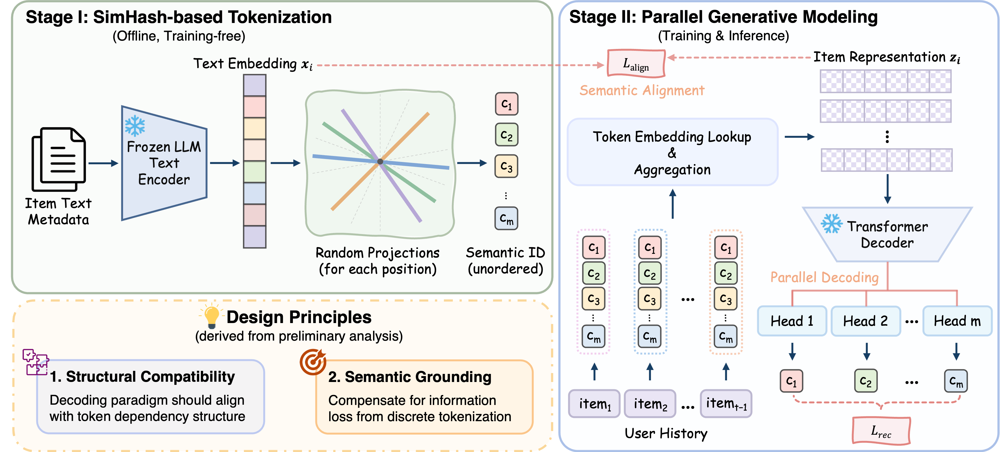

# Flash

**Flash = SimHash Semantic ID + Parallel decoding + LLM Alignment**

Flash tokenizes each item into an unordered set of discrete codes via SimHash on LLM text embeddings, then predicts all codes in parallel. A semantic regularization loss aligns the learned item representations with frozen LLM embeddings, improving generalization.

<div align="center">

</div>

## Architecture

1. **SimHash Tokenization** — Each item's LLM text embedding is hashed into `m` codebook tokens via locality-sensitive hashing.
2. **Token Aggregation** — Codebook embeddings are concatenated and projected to a single item vector, optionally aligned with the LLM embedding (cosine similarity loss).
3. **GPT-2 Backbone** — Causal self-attention over the item sequence.
4. **Parallel Prediction Heads** — `m` independent ResBlock heads, each predicting one codebook position.

## Quick Start

```bash
CUDA_VISIBLE_DEVICES=0 python main.py --model=Flash --category=Beauty
```

Available categories: `Beauty`, `Sports_and_Outdoors`, `Toys_and_Games`, `CDs_and_Vinyl`

Datasets are downloaded automatically on first run. And the OpenAI's text-embedding can be download from: https://drive.google.com/file/d/1HLy4GVfIKWVlhajXmq9_hI8oWggeU7EL/view?usp=sharing

## Key Hyperparameters

| Parameter            | Default | Description                                       |
| -------------------- | ------- | ------------------------------------------------- |
| `n_codebook`       | 32      | Number of codebook positions (semantic ID length) |
| `codebook_size`    | 256     | Entries per codebook                              |
| `n_embd`           | 448     | Hidden dimension                                  |
| `n_layer`          | 2       | Transformer layers                                |
| `align_weight`     | 0.2     | LLM alignment loss weight (0 = off)               |
| `codebook_dropout` | 0.2 | position-level dropout ratio                      |
| `temperature`      | 0.07    | Initial cosine logit temperature                  |
| `lr`               | 0.001   | Learning rate (dataset-dependent)                 |

All hyperparameters can be set via CLI (`--key=value`) or config files:

- `genrec/default.yaml` — global defaults
- `genrec/datasets/AmazonReviews2014/config.yaml` — dataset config
- `genrec/models/Flash/config.yaml` — model config


### Beauty

```bash
CUDA_VISIBLE_DEVICES=0 python main.py \
    --model=Flash \
    --category=Beauty \
    --lr=0.01 \
    --n_codebook=32 \
    --align_weight=0.1
```

### Sports and Outdoors

```bash
CUDA_VISIBLE_DEVICES=0 python main.py \
    --model=Flash \
    --category=Sports_and_Outdoors \
    --lr=0.003 \
    --n_codebook=64 \
    --n_embd= 896 \
    --align_weight=0.2
```

### Toys and Games

```bash
CUDA_VISIBLE_DEVICES=0 python main.py \
    --model=Flash \
    --category=Toys_and_Games \
    --lr=0.003 \
    --n_codebook=64 \
    --align_weight=0.2
```

### CDs and Vinyl

```bash
CUDA_VISIBLE_DEVICES=0 python main.py \
    --model=Flash \
    --category=CDs_and_Vinyl \
    --lr=0.001 \
    --n_codebook=64 \
    --codebook_size=512 \
    --align_weight=0.1
```

## Project Structure

```
genrec/
├── models/Flash/
│   ├── model.py          # Flash model (GPT-2 + parallel heads)
│   ├── tokenizer.py      # SimHash tokenizer
│   └── config.yaml       # Default hyperparameters
├── datasets/             # Dataset loaders
├── pipeline.py           # Training pipeline
├── trainer.py            # Training loop + evaluation
├── evaluator.py          # Metrics (Recall, NDCG)
└── utils.py              # Config, logging, utilities
```

## License

Flash is CC-BY-NC 4.0 licensed, as found in the LICENSE file.
